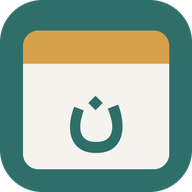
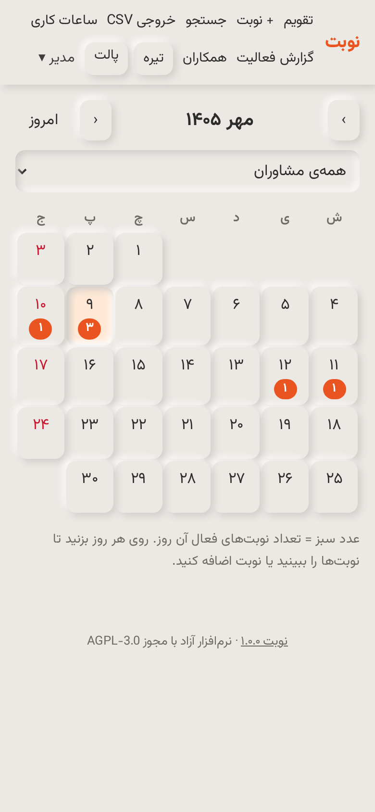
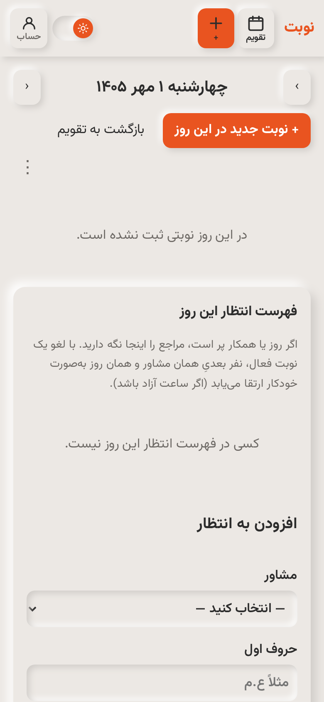
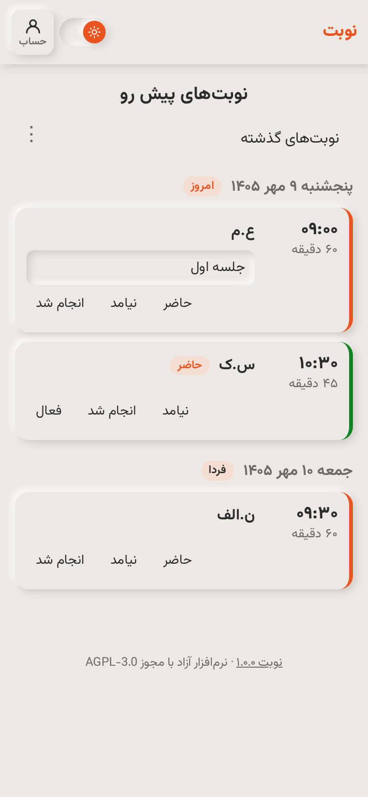

<p align="center">
  
</p>

<h1 align="center">Nobat</h1>

<p align="center">
  <strong>Self-hosted appointment scheduling for clinics and counseling practices.</strong><br>
  Persian UI · Jalali calendar · phone notifications · installable PWA · no third-party cloud.
</p>

<p align="center">
  <a href="README.fa.md">فارسی</a> ·
  <a href="docs/USER_GUIDE.md">User guide</a> ·
  <a href="docs/INSTALL.md">Install</a> ·
  <a href="CONTRIBUTING.md">Contribute</a> ·
  <a href="#setup-support">Setup support</a>
</p>

<p align="center">
  <a href="LICENSE"></a>
  <a href="https://github.com/PouryaFA81/Nobat/actions/workflows/ci.yml"></a>
</p>

---

## Who it's for

Nobat (Persian *nobat*, “appointment”) is built for a small clinic or counseling group where **one coordinator books every session** by phone or in person—and staff only need to see their own schedule.

Ideal when you want a private calendar on your own server, not another SaaS inbox.

## What it does

- **Coordinator calendar** — Jalali month view of everyone’s appointments; book, move, or cancel in one place. Each booking stores client initials, date, time, length, staff member, and an optional private note.
- **Staff view** — Each colleague signs in and sees **only their own** upcoming sessions, including notes.
- **Phone notifications** — Alerts when a session is booked, moved, or cancelled; an evening digest of tomorrow’s sessions.
- **Installable PWA** — Add Nobat to the home screen from the browser, like a native app.

<p align="center">
  
  
  
</p>

## Themes & appearance

Neumorphic UI with **light and dark modes** and switchable color palettes (default **Yaru Orange**, plus **Teal**). Hosts—and users—can pick what fits the practice; preferences stick in the browser.

## Privacy by design

Built for sensitive practices, so the surface area stays small:

- **Fully self-hosted.** No analytics cloud, no AI vendor. Push goes through your own [ntfy](https://ntfy.sh) server.
- **Minimal data.** Client initials, time, and an optional note. Full names and phone numbers are not required.
- **Lock-screen safe.** Notifications never include private notes—only initials and time.
- **Scoped access.** Staff see only their own appointments.
- **One SQLite file** for the whole dataset—simple backups and server moves.
- Hardened defaults: scrypt password hashes, CSRF protection, strict Content-Security-Policy, login rate limiting, and a service worker that never caches appointment pages on the device.

## Quick start

You need a Linux host with Docker, a domain (two subdomains), and an HTTPS reverse proxy such as Caddy.

```bash
git clone https://github.com/PouryaFA81/Nobat.git nobat
cd nobat
cp .env.example .env        # then edit it
docker compose up -d --build
```

Full walkthrough—notifications, first account, backups—is in **[docs/INSTALL.md](docs/INSTALL.md)**.

## Configuration

All settings live in `.env`:

| Setting | Default | Meaning |
|---|---|---|
| `SECRET_KEY` | *(required)* | Random secret for login cookies. Generate with `openssl rand -hex 32`. |
| `NTFY_TOKEN` | | Token the panel uses to send notifications. |
| `BASE_URL` | | Public address of the panel, e.g. `https://nobat.example.com`. |
| `NTFY_PUBLIC_URL` | | Public address of the notification server. |
| `TIMEZONE` | `Asia/Tehran` | Time zone for all dates and times. |
| `REMINDER_HOUR` | `20` | Hour when the “sessions tomorrow” reminder is sent. |
| `STAFF_LABEL` | `مشاور` | What the panel calls staff members, e.g. `پزشک` or `درمانگر`. |
| `STAFF_LABEL_PLURAL` | label + `ان` | Plural form, if the default isn’t right. |
| `SOURCE_URL` | this repository | Source code link in the footer (see [License](#license)). |
| `COOKIE_SECURE` | `1` | Set `0` only for local testing without HTTPS. |

## Setup support

Don’t have a server, or prefer not to set it up yourself? Installation and maintenance can be arranged as a paid service.

👉 **[Open a setup request](https://github.com/PouryaFA81/Nobat/issues/new?template=setup_request.yml)**. Describe what you need; don’t post private contact details in public. The maintainer will reply in the issue to arrange a private conversation.

## Contributing

Bug reports, ideas, translations, docs, and code are welcome.
Please read **[CONTRIBUTING.md](CONTRIBUTING.md)** and our **[Code of Conduct](CODE_OF_CONDUCT.md)**.
For security issues, follow **[SECURITY.md](SECURITY.md)** instead of opening a public issue.

## Tech stack

Python ([Starlette](https://www.starlette.io/)) with server-rendered Jinja templates, SQLite, a little vanilla JavaScript, and [ntfy](https://ntfy.sh) for push—packaged with Docker Compose.
The Jalali calendar is pure Python (`app/jalali.py`) with no extra dependency.

## License

Nobat is free software under the **[GNU Affero General Public License v3.0](LICENSE)** (AGPL-3.0-or-later).

You may use, study, change, and share it, including commercially. If you run a **modified** version for other people over a network, you must offer them the source of your version. The footer link (`SOURCE_URL`) is there for that.
Third-party components and their licenses are listed in [NOTICE.md](NOTICE.md).
